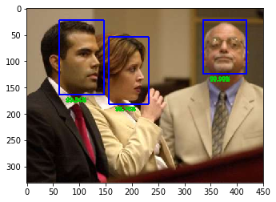
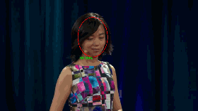

## Face Detection in Rrealtime
This repository is the implementation of face detection in real time using YOLOv3 framework with keras(tensorflow backend). For using in embeded devices, so I choose a computation-efficient CNN architecture named ShuffleNet version 2 and train it from scratch(about 50 epoches) on [FDDB](http://vis-www.cs.umass.edu/fddb/index.html) Datasets.

For some reasons,I just public the pre_trained weights, inference code and network architecture, if you want to know more,please feel free to drop a comment or [contact me](gao.gzhou#gmail.com).

### 1.Requirements
- tensorflow
- keras
- cv2
- dlib(optional)
- basic packages, e.g. numpy, matplotlib,etc.

### 2. Usage
- there is only one parameter should be noticed, i.e. pre-trained model path, run
`python detect_realtime.py -m path_to_pretrained_model (default './weights/shufflenetv2.h5' for this repo)`,
 another parameter is `video`,the video path. *script for video*.
- or follow  [detect_realtime_instruction.ipynb](./detect_realtime_instruction.ipynb) for more detail, *notebook for picture*.

### 3.References
- [(repo) YOLOv3](https://github.com/experiencor/keras-yolo3)
- [(repo) ShuffleNetV2](https://github.com/opconty/keras-shufflenetV2)
- [(paper) YOLOv3: An Incremental Improvement](https://arxiv.org/pdf/1804.02767.pdf)
- [(paper) ShuffleNet V2: Practical Guidelines for Efficient CNN Architecture Design](https://arxiv.org/abs/1807.11164)

### 4. Appendix
- shufflenetV2 for face detection architecture

